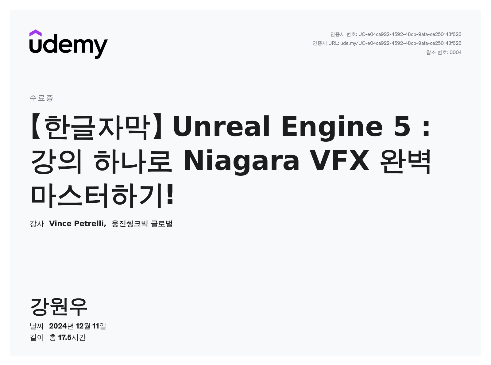

# 🎇 Unreal Niagara VFX Study Project

> **"실시간 이펙트의 원리를 이해하고 직접 구현하다."**  
>
> Udemy 강의 **'Unreal Engine 5 : 강의 하나로 Niagara VFX 완벽 마스터하기!'**를 기반으로 Unreal Engine Niagara VFX 시스템을 학습하며 제작한 실습 프로젝트입니다.

---

## 📋 1. 프로젝트 개요 (Overview)

* **프로젝트명:** Udemy Unreal Niagara VFX Study  
* **유형:** Unreal Engine 기반 실시간 VFX 학습 프로젝트  
* **개발 인원:** 1인 개발  
* **개발 목적:** Niagara 시스템의 구조 및 모듈 동작 원리 학습  
* **주요 특징:**  
    * Unreal Engine의 **Niagara System**을 활용한 파티클 이펙트 제작  
    * Emitter / System 구조 이해 및 커스터마이징  
    * Material과 연계한 실시간 시각 효과 구현  
    * 실습 중심의 단계별 VFX 제작
    * 강의 복습을 위한 개인 작품 제작

---
## 🎥 2. 실습 영상 (Practice Video)

> *아래 링크를 클릭하면 유튜브에서 고화질로 시청할 수 있습니다. (YouTube)*

### Udemy 실습 영상

[YouTube : Udemy 실습 영상](https://youtu.be/xsyFOx90I90?si=NQGeRHLeelcNYJ8m)

https://github.com/user-attachments/assets/94a4fe2e-a478-4fb3-8f68-187adfe2173b

### 복습 Nier 영상
*   Udemy에서 배운 내용을 통해 자체적으로 제작한 영상입니다. Level 내 Mesh 들은 Blender를 통해 자체 제작했습니다.
  
[YouTube : Nier](https://youtu.be/FxfLJo7ZLfc?si=RFETOVWBMa0q3dNW)

https://github.com/user-attachments/assets/3899c8ec-9880-4aea-a706-4369c895f197

---

## 🛠️ 3. 사용 기술 (Tech Stack)

### Engine & Language
*   **Unreal Engine 5.6**: Core Engine (최신 기능 활용)
*   **Blueprints**: 파티클 전용 머티리얼 제작 / Niagara Spawn 설정
*   **Camera Sequencer**: 몰입감 있는 시네마틱 카메라 연출

### Modeling
*   **Blender**: Mesh 생성

### Core Concepts
* Spawn Rate & Burst 제어
* Particle Lifetime 설정
* Color / Size / Velocity 모듈 커스터마이징
* Local / World Space 전환
* Dynamic Parameter 활용

---

## 💡 4. 주요 학습 내용 (Features)

- [나이아가라 학습 노트 보기](https://github.com/KINGWONWOO/obsidian/blob/c01251f59885cd1a43de5cb84ea0f8255d3bb616/%EC%96%B8%EB%A6%AC%EC%96%BC%20%EA%B3%B5%EB%B6%80/Unreal/%EC%9D%BC%EC%9D%BC%20%EA%B3%B5%EB%B6%80/1-UE5%20C%20%20(24.06.25.~24.08.03.)/merged%20copy.md)

---

## 🚀 5. 트러블 슈팅 (Troubleshooting)

### 이슈 1: 멀티플레이어 환경에서 Steam 연동 및 테스트 불가
* 문제: Steam Online Subsystem 설정 후에도 개발 환경에서 세션 검색 및 로그인이 정상적으로 작동하지 않음.
* 해결: SteamAppId 확인 및 Steam Sandbox(AppID 480) 설정을 통해 개발용 샌드박스 환경에서 테스트를 진행하여 해결.

### 이슈 2: 작동하던 C++ 프로젝트의 갑작스러운 컴파일 오류
* 문제: 코드 변경이 없었음에도 불구하고 엔진 업데이트나 환경 변화로 인해 프로젝트가 열리지 않거나 컴파일 에러 발생.
* 해결:
     - 프로젝트 폴더 내 Binaries, Intermediate, Saved 폴더를 삭제한 후, .uproject 우클릭 - Generate Visual Studio project files를 통해 프로젝트 파일을 재생성하여 종속성 꼬임 문제를 해결
     - 종속성 확인 및 SDK 재설치
     - 코드 재 검사
     - .uproject 메모장 편집 후 오타 확인
     - content 파일 중 한글로 된 파일/경로 확인

### 이슈 3: AI 캐릭터의 회전 및 이동의 부자연스러움
* 문제: AI가 방향을 전환할 때 순간적으로 끊기거나 부자연스럽게 회전하는 현상.
* 해결: CharacterMovementComponent 내의 Use Controller Desired Rotation 및 Orient Rotation to Movement 옵션을 조정하고, Rotation Rate 값을 세밀하게 설정하여 매끄러운 회전 보간 구현.

### 이슈 4: 엔진 버전 업데이트에 따른 입력 시스템 호환성 문제 (UE 5.1+)
* 문제: 기존 Legacy Input 방식이 최신 버전에서 제대로 작동하지 않거나 경고 발생.
* 해결: 최신 표준인 Enhanced Input System으로 마이그레이션. Input Action과 Input Mapping Context를 정의하여 유연한 입력 처리 구조로 개선.

### 이슈 5: Line Trace(Ray Tracing) 기반 물체 상호작용 시 불안정성
* 문제: 물체를 잡고 이동할 때 물체가 심하게 떨리거나 위치가 고정되지 않는 현상.
* 해결: 물체를 잡는 지점(Physics Handle)의 위치 계산 방식을 Tick에서 보간 처리하고, 잡힌 물체의 Collision Response를 조정하여 캐릭터와의 물리 충돌 간섭을 제거함으로써 안정화.

### 이슈 6: VS Code Include 인식 불가 및 라이브 코딩 오류 (2024.06.27)
* 문제: 프로젝트 내 모든 #include 경로를 찾지 못하는 에러 발생 및 라이브 코딩 기능 마비.
* 해결: .uproject 파일 우클릭 후 Generate Visual Studio project files를 실행하여 프로젝트 파일을 갱신하고, 에디터 내에서 Refresh Visual Studio Code Project를 통해 경로 재설정.

### 이슈 7: 에디터 내 VS Code 실행 불가 (Unable to open solution) (2024.06.27)
* 문제: 언리얼 에디터에서 소스 코드 열기 시 솔루션을 열 수 없다는 오류 발생.
* 해결: 프로젝트 및 에디터 실행 시 관리자 권한을 부여하여 파일 접근 권한 문제 해결.

---

## 📚 6. 공부 확장 방향(Future Study Plan)

* 실제 게임 제작해보기.(Noob에 적용)
* 이벤트(Event Handler) 기반 파티클 시스템 구조 이해  
* Dedicated Server 및 Listen Server 배포 및 관리 학습  
* 더욱 복잡한 AI Behavior Tree 및 환경 쿼리 시스템(EQS) 심화 학습, 다양한 상호작용 추가 

---

**Contact:** (강원우 / king_wonwoo@naver.com)  
